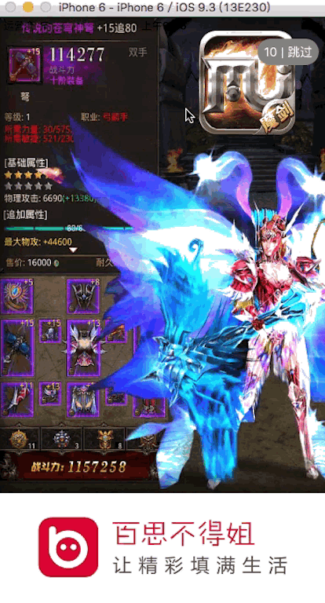

# LQLaunchImageInterstitials

###LQLaunchImageInterstitials 是一个在程序启动时植入广告目前只是展示图片，后期会进行广告的跳转。

~~~~
/**
 *  创建一个启动时广告View
 *
 *  @param url    广告图片url
 *  @param window window
 *  @param time   定时器的时间
 *  @param type   展示的方式（全屏、logo在上部分、logo在下部分）
 *  @param block  点击跳过或者时间完后的回调
 */
- (void)imageinterstitialsWithImageURL:(NSURL *)url andWindow:(UIWindow*)window andTime:(NSInteger)time andType:(LQLaunchImageType)type andBlock:(void (^)())block;
~~~~ 

####点击跳过按钮后自动移除

####时间到后自动移除

使用方法：
在appdelegate中

~~~~
 - (BOOL)application:(UIApplication *)application didFinishLaunchingWithOptions:(NSDictionary *)launchOptions 
 {
 
    NSURL *url = [NSURL URLWithString:@"https://ubmcmm.baidustatic.com/media/v1/0f000ZtVORoUP-ucKBdlJ6.jpg"];
    
    [[LQLaunchImageInterstitials sharImageInterstitials]imageinterstitialsWithImageURL:url andWindow:self.window  andTime:10 andType:LQTopLogoType andBlock:^{
   
        ViewController *vc = [[ViewController alloc]init];
        self.window.rootViewController = vc;
    }];
     
    return YES;
}
~~~~

